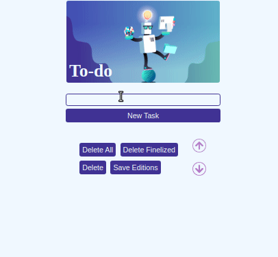

# Boas vindas ao repositório do projeto To-do List!

# Habilidades:

- Manipular CSS.
- Manipular DOM com Javascript.

--- 

## O que foir desenvolvido.

- Uma lista de tarefas usando `HTML`, `CSS` e `JavaScript` manipulando DOM.

## Linter

Para garantir a qualidade do código, foi utilizado neste projeto os linters `ESLint` e `StyleLint`.
Assim o código estará alinhado com as boas práticas de desenvolvimento, sendo mais legível
e de fácil manutenção! Para rodá-los localmente no projeto, execute os comandos abaixo:

```bash
npm run lint
npm run lint:styles
```

Quando é executado o comando `npm run lint:styles`, ele irá avaliar se os arquivos com a extensão `CSS` estão com o padrão correto.

Quando é executado o comando `npm run lint`, ele irá avaliar se os arquivos com a extensão `JS` e `JSX` estão com o padrão correto.

## Cypress

Cypress é uma ferramenta de teste de front-end desenvolvida para a web.
Você pode rodar o cypress localmente para verificar se seus requisitos estão passando, para isso execute o um dos seguintes comandos:

Para executar os testes apenas no terminal:

```bash
npm test
```

Para executar os testes e vê-los rodando em uma janela de navegador:

```bash
npm run cypress:open
```

***ou***

```bash
npx cypress open
```

Após executar um dos dois comandos acima, será aberta uma janela de navegador e então basta clicar no nome do arquivo de teste que quiser executar (project.spec.js), ou para executar todos os testes clique em Run all specs.

**Para rodar o cypress é preciso ter rodado o comando npm install anteriormente.**

## Modelo do projeto:


### Links úteis para pesquisas:

  * [Javascript.com](http://javascript.com/)
  
  * [W3Schools](https://www.w3schools.com/js/default.asp)
  
  * [MDN](https://developer.mozilla.org/pt-BR/docs/Web/JavaScript)
  
  * [StackOverflow](https://pt.stackoverflow.com/questions/tagged/javascript)
  
* Os requisitos do projeto são avaliados automaticamente, sendo utilizada a resolução de tela de `1366 x 768` (1366 pixels de largura por 768 pixels de altura).

  * #### ⚠️ Logo, recomenda-se desenvolver seu projeto usando a mesma resolução, via instalação [deste plugin](https://chrome.google.com/webstore/detail/window-resizer/kkelicaakdanhinjdeammmilcgefonfh?hl=en) do `Chrome` para facilitar a configuração da resolução. ⚠️

* Atente-se para o tamanho das imagens que você utilizará neste projeto. **Não utilize imagens com um tamanho maior que _500Kb_.**
  * #### ⚠️ Utilize uma ferramenta [como esta](https://picresize.com/pt) para redimensionar as imagens. ⚠️

### Resultado do projeto:

<div>
  
</div>